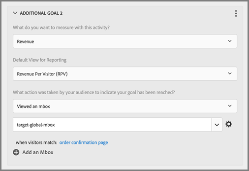

# Global mbox Frequently Asked Questions

List of Frequently Asked Questions (FAQs) about global mboxes.

## Can I have more than one global mbox if my [!DNL Target] account is set across multiple domains?

Only one global mbox is supported across your account.

You can limit where your activities run by adding URL rules to your activities. For more information, see [Include the Same Experience on Similar Pages](https://experienceleague.adobe.com/docs/target/using/experiences/vec/temtest.html).

You could also pass a parameter on the page using [targetPageParams](/help/dev/implement/client-side/atjs/atjs-functions/targetpageparams.md) and then select those parameters in the "configure URL" section in the [!UICONTROL Visual Experience Composer] (VEC) or by adding the parameters as "refinements" in the [!UICONTROL Form-Based Experience Composer].

## How do I pass revenue data on a [!DNL Target] global mbox?

To collect revenue and order information on the target-global-mbox, "mbox parameters" must be sent to [!DNL Target]. These parameters are name/value pairs used to send more information to [!DNL Target]. [!DNL Target] automatically looks for these parameters (reserved names) to populate revenue data.

For the `orderConfirmPage`, you should pass in `orderTotal`, `orderId`, and `productPurchasedId`.

These parameters must be sent to the target-global-mbox via `targetPageParams()`. For more information, see [Passing Parameters to a Global mbox](/help/dev/implement/client-side/atjs/global-mbox/pass-parameters-to-global-mbox.md).

You'll also want to add targeting to the conversion piece so that [!DNL Target] only counts conversions on the target-global-mbox when the order confirmation page has been viewed, as shown below:

The Site Pages section illustrated above contains the following selections: Current Page, URL, contains, orderconfirm.

The options in the above illustration include the following settings:

* **What do you want to measure with this activity:** Revenue 
* **Default View for Reporting:** Revenue Per Visitor (RPV) 
* **What action was taken by your audience to indicate your goal has been reached?** Viewed an mbox, target-global-mbox
