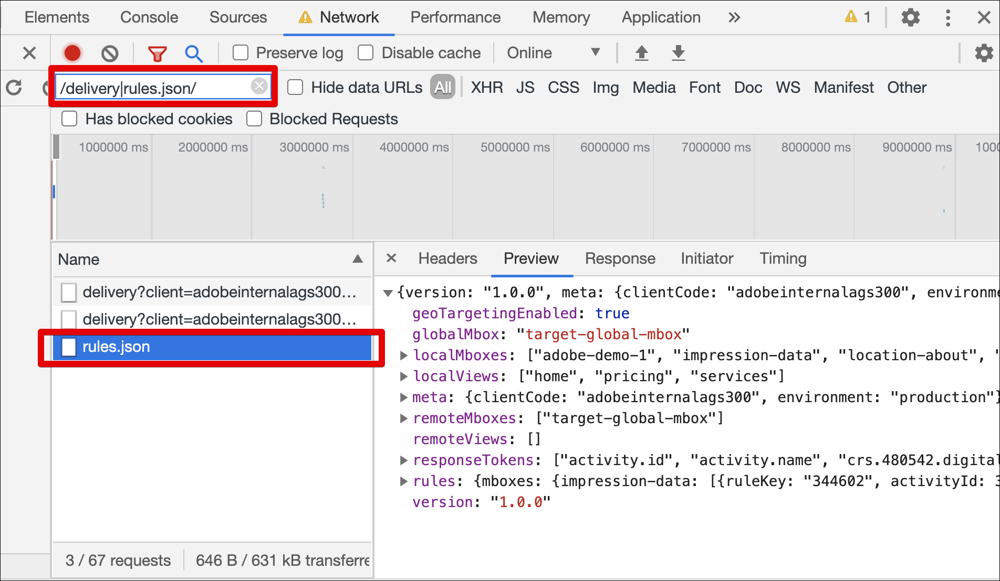

# Troubleshooting [!UICONTROL on-device decisioning] for at.js

Complete the following steps to troubleshoot [!UICONTROL on-device decisioning] in [!UICONTROL Adobe Target] with the at.js JavaScript library:

## Step 1: Enable the console log for at.js

Appending the URL parameter `mboxDebug=1` enables at.js to print messages in your browser's console. 

All messages contain a prefix "AT:" for convenient overview. To ensure that an artifact has been successfully loaded, your console log should contain messages similar to the following:

```
AT: LD.ArtifactProvider fetching artifact - https://assets.adobetarget.com/your-client-cide/production/v1/rules.json
AT: LD.ArtifactProvider artifact received - status=200
```

The following illustration shows these messages in the console log:

(Click image to expand to full width.)

{zoomable="yes"}

## Step 2: Verify the rule artifact download in your browser's Network tab

Open your browser's Network tab. 

For example, to open DevTools in Google Chrome:

1. Press Control+Shift+J (Windows) or Command+Option+J (Mac).
1. Navigate to the Network tab. 
1. Filter your calls by keyword "rules.json" to ensure that only the artifact rules file displays. 

   In addition, you can filter by "/delivery|rules.json/" to display all Target calls and artifact rules.json.

   

## Step 3: Verify the rule artifact download using at.js custom events

The at.js library dispatches two new custom events to support [!UICONTROL on-device decisioning]. 

* `adobe.target.event.ARTIFACT_DOWNLOAD_SUCCEEDED`
* `adobe.target.event.ARTIFACT_DOWNLOAD_FAILED` 

You can subscribe to listen to these custom events in your application to action upon success or failure of the artifact rules file download. 

The following example shows a sample of code listening to artifact download success and failure events:

```javascript {line-numbers="true"}
document.addEventListener(adobe.target.event.ARTIFACT_DOWNLOAD_SUCCEEDED, function(e) { 
  console.log("Artifact successfully downloaded", e.detail);
}, false);

document.addEventListener(adobe.target.event.ARTIFACT_DOWNLOAD_FAILED, function(e) { 
  console.log("Artifact failed to download", e.detail);
}, false);
```


