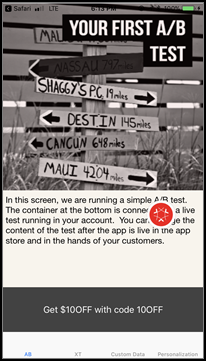

# [!DNL Target] mobile preview

Use the mobile preview link to perform easy end-to-end QA for mobile app activities and enroll yourself into different experiences right on your device without any special test devices.

## Overview

The mobile preview functionality lets you fully test your Mobile app activities prior to launching them live.

## Prerequisites

1. **Use a supported version of the SDK:** The mobile preview feature requires that you download and install the appropriate version of Adobe Mobile SDK in your corresponding apps.

   For instructions to download the appropriate SDK, see [Current SDK versions](https://developer.adobe.com/client-sdks/documentation/current-sdk-versions/){target=_blank} in the *[!DNL Adobe Experience Platform Mobile SDK]* documentation.

1. **Set up a URL scheme:** The preview link uses a URL scheme to open your app. You must specify a unique URL scheme for the preview.

   For more information, see [Visual preview](https://developer.adobe.com/client-sdks/documentation/adobe-target/#visual-preview){target=_blank} in *Adobe Target* in the *[!DNL Adobe Experience Platform Mobile SDK]* documentation.

   The following links contain more information:

   * **iOs**: For more information about setting URL schemes for iOS, see [Defining a custom URL scheme for your app](https://developer.apple.com/documentation/xcode/defining-a-custom-url-scheme-for-your-app){target=_blank} on the Apple Developer website.
   * **Android**: For more information about setting URL schemes for Android, see [Create Deep Links to App Content](https://developer.android.com/training/app-links/deep-linking){target=_blank} on the Android Developers website.

1. **Set up `collectLaunchInfo` API (i0S only)**

    For more information, see [Visual preview](https://developer.adobe.com/client-sdks/documentation/adobe-target/#visual-preview){target=_blank} in *Adobe Target* in the *[!DNL Adobe Experience Platform Mobile SDK]* documentation.

## Generating a Preview Link

1. In the [!DNL Target] UI, click the **[!UICONTROL More Options]** icon (the vertical ellipsis), then select **[!UICONTROL Create Mobile Preview]**.

   

1. Select the activities that you want to preview, then click **[!UICONTROL Generate Mobile Preview Link]**.

   >[!NOTE]
   >
   >Only form-based AB and XT activities can be selected.

   

1. Specify your app's URL scheme.

   This needs to be the same as what is present in your iOS or Android app. Repeat this process separately for iOS and Android, if required.

   

1. Click **[!UICONTROL Generate Mobile Preview Link]**, then copy the link.

   

## Preview on Your Device

Open the link in a mobile browser on a device where you have your app installed. This app can be the production app that you downloaded from the Apple App store or the Google Play store. It doesn't have to be a special build. If you have an active preview link, you will be able to view the experiences on device.

1. Open the link in your mobile browser.

    Share the link that you copied in the previous step from the [!DNL Target] UI to your mobile device in a convenient way, for example using text, email, or Slack.

    |||

    Your app opens and starts the [!DNL Target] Mobile Preview Mode. 

1. Select the combination of experiences that you want to see, then click **[!UICONTROL Launch Experiences]**.

   ||||
   ||||

## Limitations

* The view must load again for the new content to display after the **[!UICONTROL Launch Experiences]** button is clicked. The easiest way is to switch to a different screen and then come back to the screen where you are expecting the change to happen. 
* Mobile preview is not supported for Android versions earlier than API-19 (KitKat).
