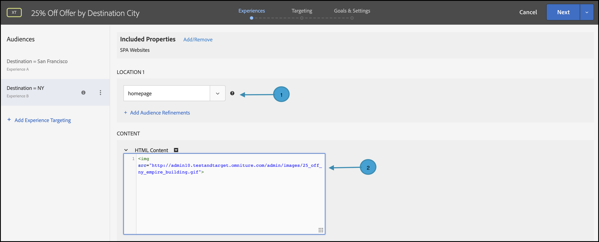

# Deliver personalization

## Summary of steps

1. Enable [!UICONTROL on-device decisioning] for your organization
1. Create an [!UICONTROL Experience Targeting] (XT) activity
1. Define personalized experience per audience
1. Verify personalized experience per audience
1. Set up reporting
1. Add metrics for tracking KPIs
1. Implement personalized offers in your application
1. Implement code to track conversion events
1. Activate your [!UICONTROL Experience Targeting] (XT) personalization activity

Suppose you are a touring company. You want to deliver a personalized offer of 25% off certain travel packages. In order for the offer to resonate with your users, you decide to show a landmark of the destination city. You also want to ensure that delivery of your personalized offers is executed at near-zero latency so it doesn't negatively impact user experiences and skew the results.

## 1. Enable [!UICONTROL on-device decisioning] for your organization

1. Enabling on-device decisioning ensures an A/B activity is executed at near-zero latency. To enable this feature, navigate to **[!UICONTROL Administration]** > **[!UICONTROL Implementation]** > **[!UICONTROL Account details]** in [!DNL Adobe Target], and enable the **[!UICONTROL On-Device Decisioning]** toggle.

   

   >[!NOTE]
   >
   >You must have the Admin or Approver [user role](https://experienceleague.adobe.com/docs/target/using/administer/manage-users/user-management.html) to enable or disable the [!UICONTROL On-Device Decisioning] toggle.

   After enabling the **[!UICONTROL On-Device Decisioning]** toggle, [!DNL Adobe Target] begins generating *rule artifacts* for your client.

## 2. Create an [!UICONTROL Experience Targeting] (XT) activity

1. In [!DNL Adobe Target], navigate to the **[!UICONTROL Activities]** page, then select **[!UICONTROL Create Activity]** > **[!UICONTROL Experience Targeting]**.

   

1. In the **[!UICONTROL Create Experience Targeting Activity]** modal, leave the default **[!UICONTROL Web]** option selected (1), select **[!UICONTROL Form]** as your experience composer (2), select a workspace and property (3), and click **[!UICONTROL Next]** (4).

   

## 3. Define a personalized experience per audience

1. In the **[!UICONTROL Experiences]** step of activity creatio, click **[!UICONTROL Change Audience]** to create an audience of those visitors who want to travel to San Francisco, California.

   

1. In the **[!UICONTROL Create Audience]** modal, define a custom rule where `destinationCity = San Francisco`. This defines the group of users who want to travel to San Francisco.

   

1. Still in the **[!UICONTROL Experiences]** step, enter the name of the location (1) within your application where you want to render a special offer regarding the Golden Gate Bridge, but only for those headed to San Francisco. In the example shown here, homepage is the location selected for the HTML offer (2), which is defined in the **[!UICONTROL Content]** area.

   

1. Add another targeting audience by clicking **[!UICONTROL Add Experience Targeting]**. This time, target an audience that would like to travel to New York by defining an audience rule where `destinationCity = New York`. Define the location within your application where you want to render a special offer regarding the Empire State Building. In the example shown here, `homepage` is the location selected for the HTML offer (2), which is defined in the **[!UICONTROL Content]** area.

   

## 4. Verify personalized experience per audience

In the **[!UICONTROL Targeting]** step, verify you have configured the desired personalized experience per audience.

  

## 5. Set up reporting

In the **[!UICONTROL Goals & Settings]** step, choose **[!UICONTROL Adobe Target]** as the **[!UICONTROL Reporting Source]** to view activity results in the [!DNL Adobe Target] UI, or choose **[!UICONTROL Adobe Analytics]** to view them in the Adobe Analytics UI.


## 6. Add metrics for tracking KPIs

Choose a **[!UICONTROL Goal Metric]** to measure the success of the activity. In this example, a successful conversion is based on whether the user clicks on the personalized destination offer.

## 7. Implement your personalized offers in your application

>[!BEGINTABS]

>[!TAB Node.js]

```js {line-numbers="true"}
const TargetClient = require("@adobe/target-nodejs-sdk");

const CONFIG = {
  client: "acmeclient",
  organizationId: "1234567890@AdobeOrg"
};

const targetClient = TargetClient.create(CONFIG);

targetClient.getOffers({
  request: {      
    execute: {
      pageLoad: {
        parameters: {
          destinationCity: "San Francisco"
        }
      }
    }       
  }
})
.then(console.log)
.catch(console.error);
```

>[!TAB Java]

```java {line-numbers="true"}
ClientConfig config = ClientConfig.builder()
  .client("acmeclient")
  .organizationId("1234567890@AdobeOrg")
  .build();
TargetClient targetClient = TargetClient.create(config);

Context context = new Context().channel(ChannelType.WEB);

ExecuteRequest executeRequest = new ExecuteRequest();

RequestDetails pageLoad = new RequestDetails();
pageLoad.setParameters(
    new HashMap<String, String>() {
      {
        put("destinationCity", "San Francisco");
      }
    });

executeRequest.setPageLoad(pageLoad);

TargetDeliveryRequest request = TargetDeliveryRequest.builder()
  .context(context)
  .execute(executeRequest)
  .build();

TargetDeliveryResponse offers = targetClient.getOffers(request);
```

>[!ENDTABS]

## 8. Implement code to track conversion events

>[!BEGINTABS]

>[!TAB Node.js]

```js {line-numbers="true"} 
//... Code removed for brevity

//When a conversion happens
TargetClient.sendNotifications({
    targetCookie,
    "request" : {
      "notifications" : [
        {
          type: "click",
          timestamp : Date.now(),
          id: "conversion",
          mbox : {
            name : "destinationOffer"
          }
        }
      ]
    }
})
```

>[!TAB Java]

```java {line-numbers="true"
ClientConfig config = ClientConfig.builder()
  .client("acmeclient")
  .organizationId("1234567890@AdobeOrg")
  .build();
TargetClient targetClient = TargetClient.create(config);

Context context = new Context().channel(ChannelType.WEB);

ExecuteRequest executeRequest = new ExecuteRequest();

RequestDetails pageLoad = new RequestDetails();
pageLoad.setParameters(
    new HashMap<String, String>() {
      {
        put("destinationCity", "San Francisco");
      }
    });

executeRequest.setPageLoad(pageLoad);
NotificationDeliveryService notificationDeliveryService = new NotificationDeliveryService();

Notification notification = new Notification();
notification.setId("conversion");
notification.setImpressionId(UUID.randomUUID().toString());
notification.setType(MetricType.CLICK);
notification.setTimestamp(System.currentTimeMillis());
notification.setTokens(
    Collections.singletonList(
        "IbG2Jz2xmHaqX7Ml/YRxRGqipfsIHvVzTQxHolz2IpSCnQ9Y9OaLL2gsdrWQTvE54PwSz67rmXWmSnkXpSSS2Q=="));

TargetDeliveryRequest targetDeliveryRequest =
    TargetDeliveryRequest.builder()
        .context(context)
        .execute(executeRequest)
        .notifications(Collections.singletonList(notification))
        .build();

TargetDeliveryResponse offers = targetClient.getOffers(request);
notificationDeliveryService.sendNotification(request);
```

>[!ENDTABS]

## 9. Activate your Experience Targeting (XT) activity

